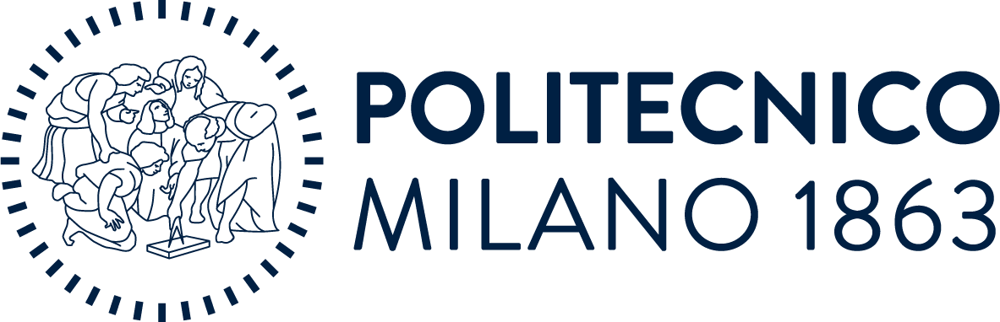
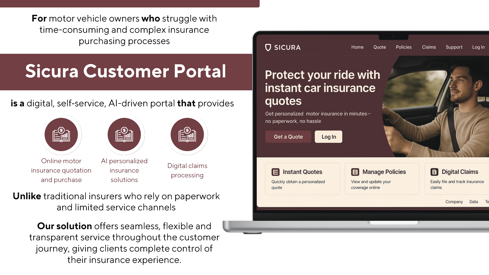
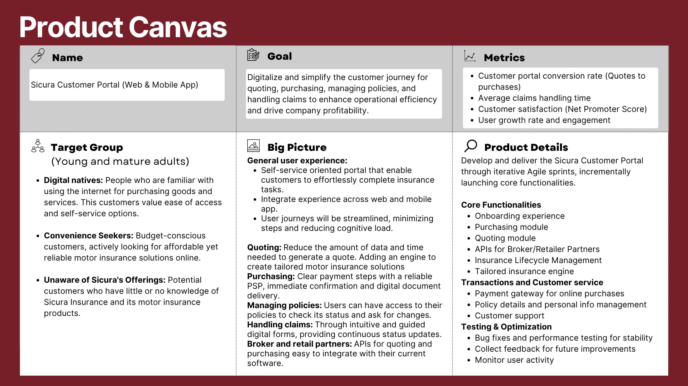

   &nbsp;&nbsp;&nbsp;&nbsp;&nbsp;
   &nbsp;&nbsp;&nbsp;&nbsp;&nbsp;
  

# Sicura Agile Digital Transformation

This repository contains a digital transformation strategy developed for **Sicura** motor insurance company. The project was developed as part of the **Agile Project Management** course at **Politecnico di Milano**, in collaboration with **PwC Italy**.

Our objective was to address Sicura’s core business challenges, including operational inefficiency and lack of online sales, by designing an AI-powered, customer-centric digital portal. The solution follows Agile methodology, from Epics and User Stories to MVP planning and sprint roadmapping.

> 📄 Full proposal presentation: [Digital-Transformation-Proposal.pdf](Digital-Transformation-Proposal.pdf)

 

## 📌 Business Challenge

Sicura Insurance faces structural inefficiencies and growing competition in a digitally transforming market. With no online sales capability and rising pressure to optimize claims handling, the company needed a strategy to enhance customer reach and reduce costs.

---

## 💡 Proposed Solution: AI-Powered Customer Portal

We proposed a digital portal to enable seamless policy quoting, personalized insurance recommendations, online purchases, and claims management — reducing customer effort and improving satisfaction.

---

## 📊 Business Model Canvas

The team redefined Sicura's business model using the Business Model Canvas and Product Canvas frameworks, aligning digital transformation with revenue growth and partnership strategies across B2C and B2B channels. The solution addresses key pain points for individual policyholders and business clients, offering digital convenience, personalization, and flexible integration for brokers and retailers.

---

## 🧩 Epics & User Stories

All functionality was broken into Agile epics and prioritized user stories, with acceptance criteria and story points defined for iterative delivery.

👉 [Click here to view all user stories.](docs/user-stories.md)

---

## 📦 MVP and Backlog Prioritization

The MVP includes core functionalities such as user registration, quoting, and purchasing. Additional features were categorized by priority to guide sprint execution.

---

  
 

### License:
This project is licensed under the MIT License. See the [LICENSE](./LICENSE) file for details.
