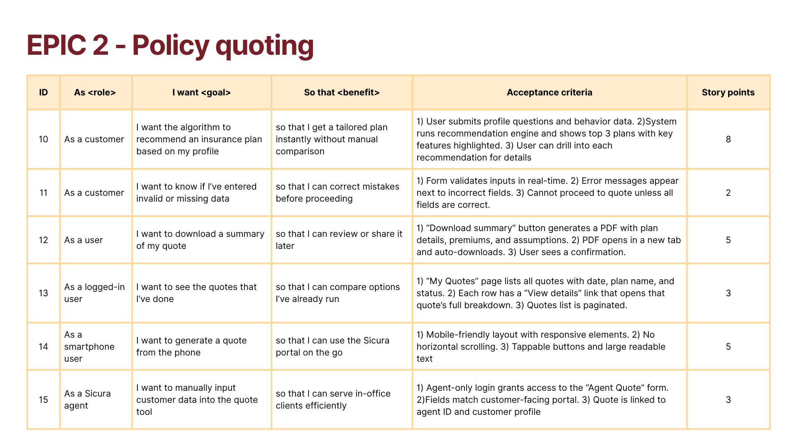
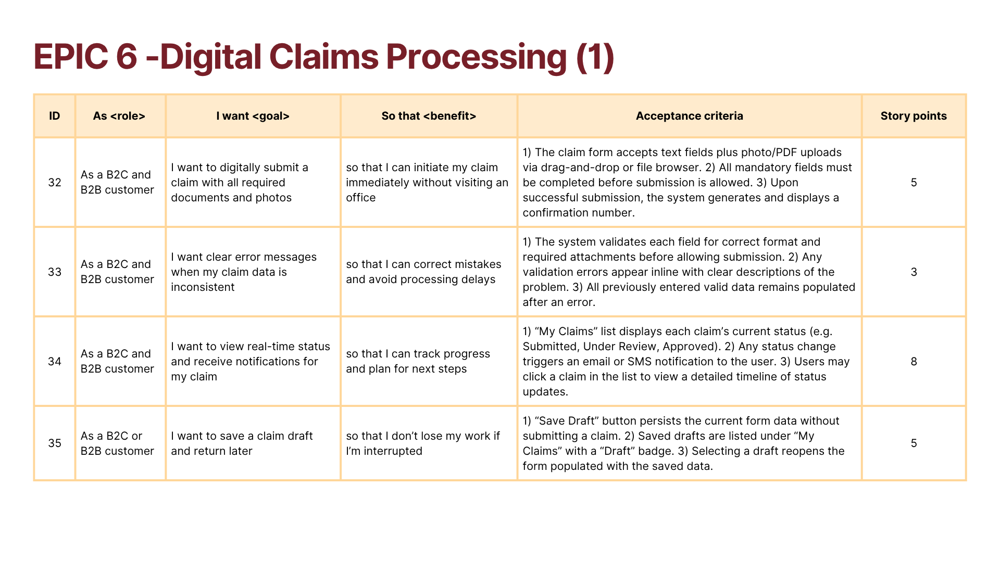

# 📋 User Stories

This section contains all key user stories defined during the Agile development process. Each story includes the user type, goal, acceptance criteria, and story points.

### Epic 1 - Account Management

### Epic 2 - Policy Quoting

### Epic 3 - Policy Purchasing

### Epic 4 - AI-Powered Quote Personalization

### Epic 5 - Policy Management

### Epic 6 - Digital Claims Processing

### Epic 7 - Customer Support

### Epic 8 - API for Brokers/Partners Integration

